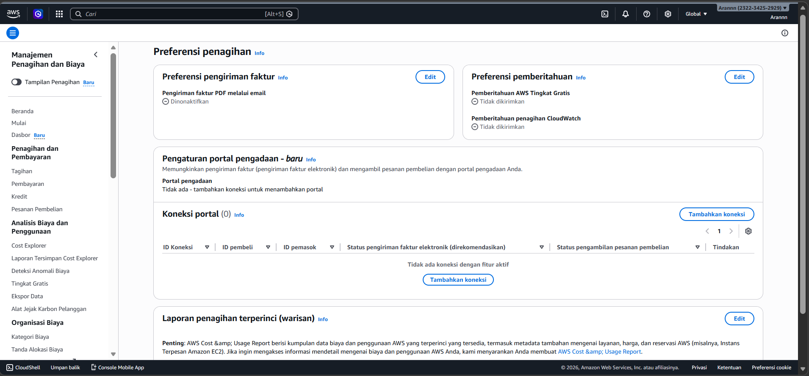
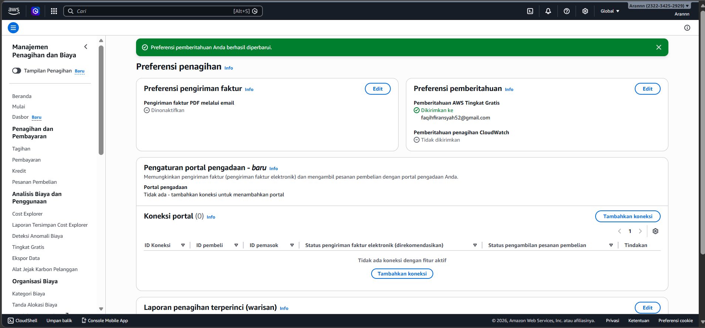
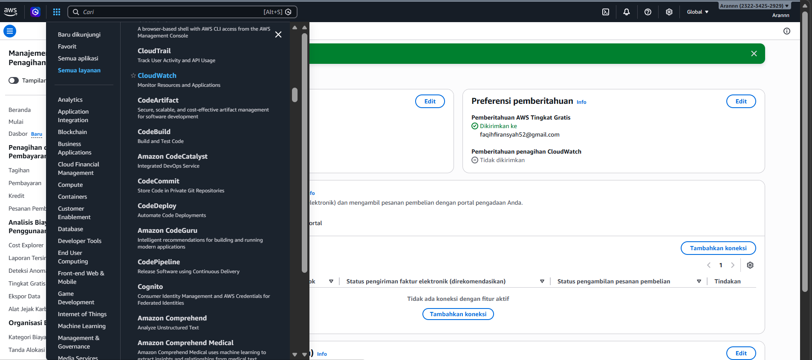
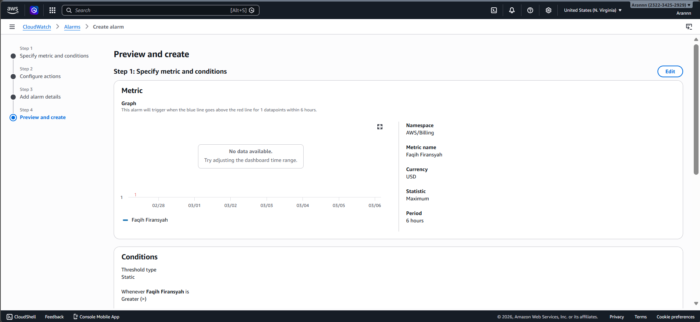
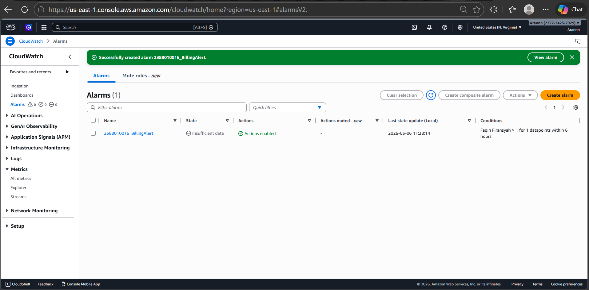

#membuat Billing Allert di AWS untuk menghindari alokasi dana

1. Menu dashboard AWS lalu pilih Billing Preference
- Masuk Menu Billing and Cost Manajemen
- Pada Menu Cost Manajemen Scroll Ke bawah pilih -  -  Billing Preferences
- Pilih Menu Alert Preferences klik Edit
- isi Email ceklis Receive
- Klik Update

2. Masuk Menu Cloudwatch, All Services lalu Pilih CLoudWatch

3. Pilih Menu Create Alarm
- Pastikan Region ada di US N Virginia
- Klik Menu Create ALert
- Klik Metric
- Klik Menu Billing
- Pilih Menu Total Estimated Charge
- Pilih / Ceklis Mata Uang USD
- Klik Select Metric
- beri nama Alert = NIM_BillingAlert
- COnditions Static->Greathertha-> 1 USD
- Create new Topic = > NIM_BillingAlert -> Klik Create
- Select an existing SNS topic - > NIM_BillingAlert
- Klik Next
- Alarm Name -> NIM_BillingAlert
- Create Alarm
- Buka Inbox/Spam Email dari AWS kemudian Klik Confirm

