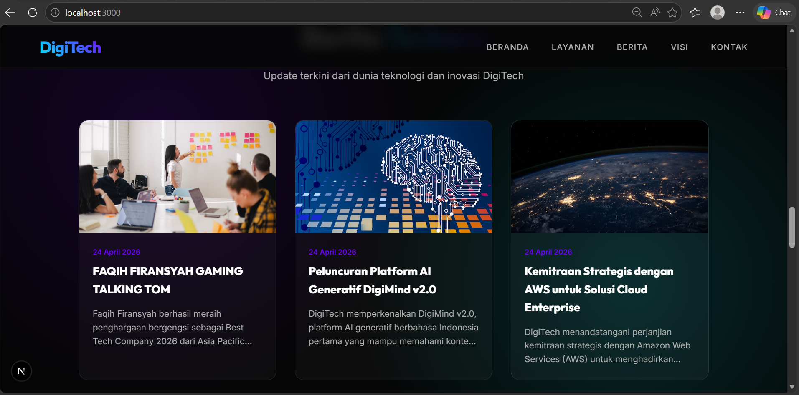
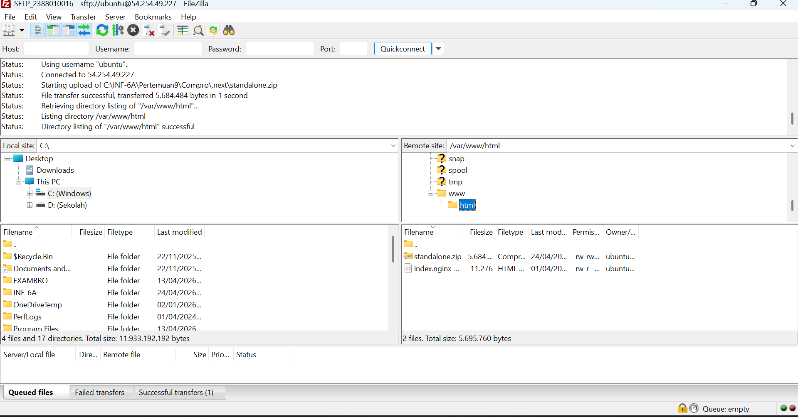

# Deploy web apps framework next.js ke aws

1. pastikan web apps berjalan di lokal
- install dependensi 'npm install'
- jalankan web apps 'npm run dev'
- akses web apps di browser 'http://localhost:3000'

2. proses deploy file ke AWS
- nyalakan instance AWS
- Connect open SSH
- Connect Filezilla
